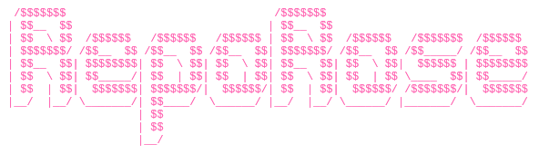

---
A CLI tool that scans any codebase, maps its dependency graph, generates AI-powered summaries, and serves an interactive 3D visualization in your browser.

Visit us at www.reporose.tech

> Be 'real', speak with heart.
 
## What is Reporose

Reporose reads through your repository files and builds a structural map of the project. It tracks how files depend on each other and scores which files are more important based on how many other files depend on them and where they sit in the dependency graph. It also uses smaller models to create descriptions of what the files contents do.

**Its main purpose is to save agentic AI tokens.** Instead of feeding many files into an AI, you can provide one map file (`.reporose/map.json`) and the agent gets exact project context, including what the project does, which files are central, and which file should be targeted for a specific change.


## Features

- **AST-based scanning** -- Parses JS/TS/JSX/TSX with full function, import, and export extraction
- **Dependency mapping** -- Direct links, indirect (2-hop) links, circular dependency detection (Tarjan SCC), and betweenness centrality
- **Transitive importance scoring** -- Entry-point files that orchestrate critical modules are ranked properly (not just files with many importers)
- **AI summaries** -- Supports Ollama (local & cloud), Anthropic, Groq, OpenAI, OpenRouter, DeepSeek, LM Studio, and any OpenAI-compatible API
- **Rate limit handling** -- Parses `retry-after`, `x-ratelimit-reset-tokens`, and Groq-specific headers; sleeps exactly the right amount
- **Live streaming** -- Terminal shows real-time AI token output from both local and cloud providers
- **Persistent model loading** -- Keeps Ollama models loaded in RAM (`keep_alive: -1`) for zero cold-start latency
- **Interactive 3D graph** -- Force-directed visualization with search, filtering, and detail panels
- **Caching** -- Only re-summarizes files that have changed (MD5-based)

## Installation

```bash
# Install globally from npm
npm install -g reporose

# Or clone and link manually
git clone https://github.com/MIbrahimPro/RepoRose.git
cd RepoRose
npm install
npm link
```

### MCP Server Setup

Reporose can be used as an MCP (Model Context Protocol) server. Add to your MCP config:

```json
{
  "mcpServers": {
    "reporose": {
      "command": "npx",
      "args": ["reporose", "mcp"]
    }
  }
}
```

## Quick Start

```bash
cd /path/to/your/project

# Initialize configuration (interactive wizard)
reporose init

# Analyze the repository
reporose analyze

# Serve the interactive 3D visualization
reporose serve
```

## Commands

### `reporose init [path]`

Interactive setup wizard. Walks you through:
- Choosing an AI provider (Ollama local/cloud, Anthropic, Groq, OpenAI, OpenRouter, heuristic, or none)
- Setting up model names and API keys
- Configuring context windows and generation parameters
- Saving the configuration to `.reporose/config.json`

Path is optional - defaults to current directory.

### `reporose analyze [path]`

Scans the repository, maps dependencies, and generates AI descriptions. Outputs `.reporose/map.json`. Path is optional - defaults to current directory.

```
Options:
  --out <dir>            Output directory (default: .reporose)
  --silent               Suppress progress logging
  --no-map               Skip dependency mapping (Phase 2)
  --no-summarize         Skip AI description generation (Phase 3)
  --include-hidden       Include dot-folders (.vscode, .github, etc.) - default: excluded
  --include-docs         Include docs (.md, .txt, .html, etc.) - default: excluded
  --include-media        Include media (.png, .jpg, .svg, .mp4, etc.) - default: excluded (media appears in map but not parsed)
```

By default, only code files are parsed. Media files appear in the dependency map for visibility but are not analyzed for content. Use `--include-media` if you want media files included in the scan results.

### `reporose serve [path]`

Starts a local server with an interactive 3D force-directed graph visualization. Path is optional - defaults to current directory.

```
Options:
  --port <n>             Desired port (default: 8689, auto-fallback if taken)
  --host <addr>          Bind address (default: 127.0.0.1 for local only)
  --no-open              Do not open the browser automatically
  --silent               Suppress request logs
```

### `reporose config [path]`

View or modify the AI provider configuration. Path is optional - defaults to current directory.

```
Options:
  --model <name>         Provider: heuristic | none | ollama | ollama-cloud | anthropic | openai | openrouter | local
  --model-name <name>    Model name for the active provider
  --base-url <url>       Base URL for the active provider
  --api-key-env <var>    Env var name holding the API key
  --ollama-url <url>     Ollama base URL (default: http://localhost:11434)
  --ollama-model <name>  Ollama model name
  --num-ctx <n>          Ollama context window size (default: 32000)
  --temperature <f>      Temperature for generation (0-1, default: 0)
  --num-predict <n>      Max tokens to predict
  --show                 Print the current configuration
```

### `reporose summarize [path]`

Re-runs AI descriptions on an existing `map.json` without re-scanning. Path is optional - defaults to current directory.

### `reporose map [path]`

Re-runs dependency mapping on an existing scan output without re-scanning or re-summarizing. Path is optional - defaults to current directory.

### `reporose preset <action> <name> [path]`

Manage reusable AI configuration presets.

```bash
# Save current config as a preset
reporose preset save my-ollama /path/to/repo

# List all saved presets
reporose preset list

# Apply a preset to a repo
reporose preset use my-ollama /path/to/repo

# Delete a preset
reporose preset delete my-ollama
```

## AI Provider Setup

### Ollama Cloud (Genorous Free Tier + Paid option)

```bash
# Get API key: https://cloud.ollama.com
export OLLAMA_API_KEY=ollama-...

reporose config --model ollama-cloud \
  --model-name gpt-oss:20b-cloud \
  --api-key-env OLLAMA_API_KEY
```

### Groq (Cloud, Free Tier)

```bash
# Get API key: https://console.groq.com
export GROQ_API_KEY=gsk-...

reporose config --model openai \
  --base-url https://api.groq.com/openai/v1 \
  --model-name llama-3.1-8b-instant \
  --api-key-env GROQ_API_KEY
```

### Ollama (Local, Free)

```bash
# Install Ollama: https://ollama.ai
ollama pull qwen2.5-coder:0.5b

reporose config --model ollama \
  --ollama-model qwen2.5-coder:0.5b \
  --num-ctx 32000
```

### Other Providers (Not extensively tested, but should work)

#### Anthropic

```bash
export ANTHROPIC_API_KEY=sk-ant-...

reporose config --model anthropic \
  --model-name claude-haiku-4-5 \
  --api-key-env ANTHROPIC_API_KEY
```

#### OpenAI

```bash
export OPENAI_API_KEY=sk-...

reporose config --model openai \
  --model-name gpt-4o-mini \
  --api-key-env OPENAI_API_KEY
```

#### OpenRouter

```bash
export OPENROUTER_API_KEY=sk-or-...

reporose config --model openrouter \
  --model-name openai/gpt-4o-mini
```

#### Heuristic (No AI, Instant)

```bash
reporose config --model heuristic
```

Generates rule-based descriptions from AST patterns. No API calls, no latency.

#### None (Disable Descriptions)

```bash
reporose config --model none
```

## Output Structure

After running `reporose analyze`, you get `.reporose/map.json` containing:

```
{
  "files": [           // Every file with path, hash, language, functions, imports, exports
    {
      "id": "file_001",
      "path": "src/App.jsx",
      "language": "javascript",
      "importance_score": 8.5,
      "description": "Main application component that...",
      "functions": [...],
      "imports": [...],
      "exports": [...]
    }
  ],
  "packages": [...],           // Declared npm dependencies with usage counts
  "links": [...],              // Direct, indirect, circular, and package links
  "circular_dependencies": [], // Detected cycles with risk levels
  "networks": [...],           // Connected components (main vs isolated)
  "statistics": {              // Summary metrics
    "total_files": 33,
    "most_important_file": { "file_id": "...", "importance": 10 }
  }
}
```

## How Importance Scoring Works

Reporose combines four signals to rank every file on a 0-10 scale:

1. **Incoming connections** (x1.2) -- How many files import this one
2. **Outgoing connections** (x0.8) -- How many files this one imports
3. **Usage frequency** (x0.5) -- Total import statements pointing here
4. **Betweenness centrality** (x1.5) -- How often this file sits on the shortest path between other files

After computing initial scores, a **transitive propagation pass** runs 3 iterations: files that import high-scoring files receive a decaying bonus (40% of average target importance per iteration). This ensures entry points like `main.jsx` that orchestrate critical modules are properly credited.

## Development

```bash
# Run the test suite
npm test

# Analyze a repo (from this directory)
npm run analyze

# Serve the visualization
npm run serve
```

## Requirements

- Node.js 18+ (uses native `fetch`)
- Ollama (optional, for local AI)

## Sponsorship

Setting up GitHub Sponsors to support ongoing development.

<!-- - **GitHub Sponsors**: https://github.com/sponsors/MIbrahimPro -->

## License

[](https://www.gnu.org/licenses/gpl-3.0)

GPL-3.0 - You can fork, modify, and use this project commercially. You must keep your fork open source and credit the original project.